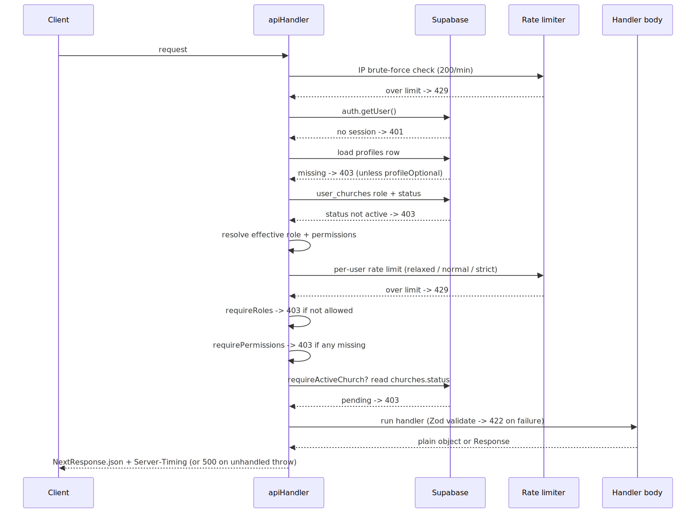

# Ekklesia — System Design & Architecture Reference

> Onboarding doc for engineers new to the codebase. Assumes you know the basics
> (HTTP, SQL, React, TypeScript) but not this app's conventions.
> Ground truth is the source; every claim below cites the file it came from.
> Read alongside `CLAUDE.md` (the project bible) and `docs/PRODUCT_SPEC.md` (what the product does).
>
> Last updated: 2026-07-14 · Migration ceiling: **091** (Service Builder) · Live on **miaekklesia.com** (pre-pilot).

---

## Diagram index

Every major subsystem has a diagram in its section. Jump to one:

- [System context / high-level architecture](#1-overview) — §1
- [Request lifecycle](#1-overview) — §1
- [Multi-tenancy & RLS (defense in depth)](#2-multi-tenancy) — §2
- [Core data model (tenancy-centered ER)](#2-multi-tenancy) — §2
- [Auth session + permission resolution](#3-auth-roles--permissions) — §3
- [`apiHandler` pipeline (sequence)](#4-api-layer--apihandler) — §4
- [Feature-flag gating](#7-feature-flags) — §7
- [Service Builder (run-of-show segments)](#8-storage) — §8
- [Messaging / notification pipeline](#9-messaging--notifications) — §9
- [Environments & deploy flow](#10-migrations-model) — §10

---

## 1. Overview

Ekklesia is a **multi-tenant, mobile-first PWA** for Arabic-speaking churches, built on
**Next.js 15 (App Router)** + **Supabase (Postgres + Auth + Storage)**, deployed to **Vercel**.
"Multi-tenant" means one deployment serves many churches; every row of data belongs to exactly
one church (`church_id`) and is isolated by Postgres **Row-Level Security (RLS)** plus an
application-level rule that *every* query filters by `church_id`.

The request path is deliberately layered so that auth and tenant-isolation are enforced in more
than one place (defense in depth): the **middleware** is the coarse gate, **`apiHandler`** /
`getCurrentUserWithRole()` is the fine-grained gate, and **RLS** is the last line inside the
database. A bug in one layer should not leak data because the next layer still holds.

### System context



*How the pieces talk: the PWA reaches Supabase only through Vercel (middleware → Server Components / API routes); the app-server calls FCM, Resend, WhatsApp and Upstash, while the browser talks to PostHog and FCM directly.*

### Request lifecycle



*The browser-to-DB path, layered: middleware is the coarse gate (flags, locale, session redirect), then a page or `apiHandler` does the fine-grained auth, and Postgres RLS is the last check inside the database.*

Key: the middleware runs the **fast** local JWT check (`getSession()` — no network hop) purely to
decide "is there a session at all?" The **secure** verification (`supabase.auth.getUser()`, which
re-validates the token with Supabase) happens again inside every page load and every API route.
Never trust `getSession()` for authorization — only for the cheap redirect gate.
(`middleware.ts:97`, `lib/auth.ts:21`, `lib/api/handler.ts:76`.)

---

## 2. Multi-tenancy

**The single most important rule in this codebase:** every table has a `church_id` column, and
**every query must filter by it** (`.eq('church_id', churchId)`). This is `CLAUDE.md` §13 rule 12
and it is non-negotiable. RLS enforces the same rule server-side, but application code must not
rely on RLS alone — filter explicitly.


*A query is guarded twice — the app-layer `church_id` filter and the database RLS policy — so if a handler forgets the filter, RLS still prevents cross-church reads. Only the service-role admin client bypasses RLS, and it must scope by hand.*

### How `church_id` is resolved

A user is one **auth identity** (`auth.users`) that can belong to **many churches** via the
`user_churches` join table (migration 031). The identity's *currently active* church is
`profiles.church_id`. Resolution happens in `getCurrentUserWithRole()` (`lib/auth.ts:18`), a
React-`cache()`-wrapped helper used by Server Components:

1. `supabase.auth.getUser()` — securely verify the session, get the `auth.users` id.
2. One joined query loads the profile **and** its church: `profiles.select('*, church:church_id(*)')`.
3. Cross-reference the **authoritative per-church role** from `user_churches` (see §3).
4. Gate on membership **status** — a non-`active` membership (`managed`/`invited`/`inactive`/`pending`)
   is redirected to `/membership-pending`, not let in (`lib/auth.ts:61`, `lib/membership.ts`).
5. Resolve permissions (§3) and return `{ id, email, profile, church, resolvedPermissions }`.

In API routes, `apiHandler` does the equivalent: it loads `profiles` (id, church_id, role,
permissions) for the authenticated user, checks the `user_churches` status, and exposes
`ctx.profile.church_id` to the handler body (`lib/api/handler.ts:82`–`128`). A handler then writes
`.eq('church_id', profile.church_id)` on every query — see the canonical route in §4.

### The cross-tenant exception

The **Community Needs** marketplace is the one deliberately cross-church surface: churches post
needs that *other* churches can see and respond to. It has bespoke cross-church RLS and strips PII
before crossing the tenant boundary (`CLAUDE.md` §5, migrations 035/043). Everything else is
strictly single-tenant.

### Core data model (tenancy-centered)



*A representative slice (~10 of ~50 tables): `churches` is the tenant root and almost every table carries the `church_id` linking column. One auth identity (`profiles`) belongs to many churches via `user_churches`, which holds the authoritative per-church `role` and `status`.*

---

## 3. Auth, roles & permissions

### Auth

Supabase Auth, session in cookies (SSR cookie handling in `lib/supabase/server.ts`). Two clients:

- **`createClient()`** — server client bound to the request's cookies; runs **as the logged-in
  user**, so RLS applies. Use this in pages and API routes.
- **`createAdminClient()`** — service-role client that **bypasses RLS**. Use *only* for legitimate
  cross-tenant or system work (notification dispatch, church switching, platform approval,
  attachment upload). Never hand it user-controlled filters without re-scoping by hand.

Browser code uses `lib/supabase/client.ts` (`createBrowserClient`). Note: none of the clients use
the `<Database>` generic — it produces `never` type errors until Supabase CLI types are generated
(`lib/supabase/client.ts:3`, `CLAUDE.md` §13 rule 11).

### The four roles

| Role | Scope |
|---|---|
| `super_admin` | Full access to their church — always resolves to *every* permission. |
| `ministry_leader` | Admin-level ministry ops (events, serving, visitors, expense approval). No permission/settings management. |
| `group_leader` | Leads one small group (attendance, assigned visitors, submit expenses). |
| `member` | Regular congregant — almost everything gated behind permission flags (all `false` by default). |

The **authoritative** role for a church is `user_churches.role`, **not** `profiles.role`. Both
`getCurrentUserWithRole()` and `apiHandler` cross-reference `user_churches` and use its role if
present (`lib/auth.ts:65`, `lib/api/handler.ts:113`). This closes a privilege-escalation hole: if
`profiles.role` goes stale after a church switch, the per-church `user_churches.role` still wins. A
DB trigger keeps the two in sync (migration 076).

### Permission resolution (three additive layers)

Permissions are boolean flags (`PermissionKey`, ~27 of them, listed in `lib/permissions.ts:7`).
`resolvePermissions(role, churchDefaults, userOverrides)` merges three layers in order
(`lib/permissions.ts:159`):

1. **Hardcoded role default** — `HARDCODED_ROLE_DEFAULTS[role]` (`lib/permissions.ts:83`).
2. **Church-level role default** — row in `role_permission_defaults` for `(church_id, role)`.
3. **User-specific override** — `profiles.permissions` (JSONB).

Rules:
- **`super_admin` short-circuits** — always gets everything, ignoring layers 2–3.
- **User overrides are additive only** — they can grant (`true`) but never revoke
  (`lib/permissions.ts:181`). To remove access you change the church/role default, not the override.


*From cookie to resolved permissions (`lib/auth.ts`, `lib/permissions.ts`): the per-church `user_churches.role` wins over `profiles.role`, `super_admin` short-circuits to all-true, and the three permission layers merge additively (overrides can grant but never revoke).*

### Enforcing roles & permissions

- **In Server Components:** `requireRole('super_admin')` / `requirePermission('can_manage_events')`
  at the top of a page — redirects to `/dashboard` if the check fails (`lib/auth.ts:194`, `:206`).
- **In API routes:** the `apiHandler` options `requireRoles` / `requirePermissions` return **403**
  before your handler body runs (`lib/api/handler.ts:150`, `:155`).

---

## 4. API layer — `apiHandler`

**Every API route goes through `apiHandler`** (`lib/api/handler.ts`). It eliminates ~15 lines of
per-route boilerplate and, more importantly, prevents auth gaps — you cannot forget the auth check
because the wrapper does it. Do not hand-roll auth/role/rate-limit logic in a route
(`CLAUDE.md` §13 rule 7).

### What the wrapper does, in order

1. **IP brute-force limit** — pre-auth, generous (200/min per IP+route) (`handler.ts:61`).
2. **Auth** — `getUser()`; 401 if no valid session (unless `requireAuth: false`) (`:76`).
3. **Profile load** — fetches `profiles` for the user; 403 if missing (unless `profileOptional`) (`:82`).
4. **Membership status gate** — non-`active` membership → 403 (`:108`).
5. **Effective role + permission resolution** — from `user_churches` + `role_permission_defaults` (`:113`).
6. **Per-user rate limit** — tier chosen by method (default `relaxed` for GET, `normal` for
   mutations) (`:135`). Keyed by **user id**, not IP — church members share one WiFi/IP.
7. **`requireRoles`** — 403 if the role isn't allowed (`:150`).
8. **`requirePermissions`** — 403 unless *all* listed permissions resolve true (`:155`).
9. **`requireActiveChurch`** — 403 if the church is still `pending` platform approval (`:164`).
10. **Run the handler**, then wrap a returned plain object in `NextResponse.json` and attach a
    **`Server-Timing`** header (`handler;dur=<ms>`) for latency observability (`:189`).
11. **Error handling** — a thrown `ValidationError` → **422** with `fields`; anything else →
    **500** with a generic message (never leak internals) (`:209`).



*The ordered gauntlet inside `lib/api/handler.ts`: each dashed reply is an early-exit failure branch (401 / 403 / 429 / 422) that stops before the handler body runs; only a request that clears every gate reaches your code.*

### Options (`HandlerOptions`)

| Option | Effect |
|---|---|
| `requireAuth` (default `true`) | Require a valid session. |
| `profileOptional` | Authed but profile may be null (e.g. onboarding before joining a church). |
| `requireRoles: UserRole[]` | Allow only these roles → else 403. |
| `requirePermissions: PermissionKey[]` | Require **all** listed permissions → else 403. |
| `requireActiveChurch` | Block a pending (unapproved) church from outward mutations. |
| `rateLimit: 'none'\|'relaxed'\|'normal'\|'strict'` | Override the auto tier (10/30/100 per min). |
| `cache: string` | Set a `Cache-Control` header on the response. |

Rate-limit tiers: `strict` 10/min (auth, registration, push), `normal` 30/min (mutations),
`relaxed` 100/min (reads) (`handler.ts:26`).

### Zod validation

Request bodies are validated with Zod schemas from `lib/schemas/`. `validate(schema, data)`
(`lib/api/validate.ts`) throws `ValidationError` on failure, which `apiHandler` turns into a 422
with per-field messages. Never trust a request body without validating it (`CLAUDE.md` §13 rule 8).

### Canonical route example (`CLAUDE.md` §6)

```ts
import { apiHandler } from '@/lib/api/handler'
import { validateBody } from '@/lib/api/validate'
import { donationSchema } from '@/lib/schemas/donation'

export const POST = apiHandler(async ({ req, supabase, profile, user }) => {
  const body = await validateBody(req, donationSchema)
  // ... every query below filters .eq('church_id', profile.church_id)
}, { requireRoles: ['ministry_leader', 'super_admin'] })
```

Real example — `app/api/events/[id]/segments/route.ts` — shows GET/PUT/POST all scoped by
`.eq('church_id', profile.church_id)`, PUT/POST gated by `requirePermissions: ['can_manage_events']`,
input validated with `validate(...)`, and cache invalidated with `revalidateTag(...)` after writes.

---

## 5. Data fetching, caching & pagination

These are `CLAUDE.md` §6 guidelines, enforced by the review agents.

**Parallelize independent data** — never sequential `await`s:

```ts
const [funds, accounts, members] = await Promise.all([
  getFunds(churchId), getAccounts(churchId), getMembers(churchId),
])
```

**Cache aggregates with `unstable_cache` + tag invalidation:**

```ts
const getData = unstable_cache(
  async (churchId: string) => { /* query */ },
  ['cache-key'],
  { tags: [`tag-${churchId}`], revalidate: 300 }
)
// In a mutation route, after the write:
revalidateTag(`tag-${churchId}`)
```

TTL guide (`CLAUDE.md` §6): dashboard summaries 300s, reference data (funds/groups) 3600s, member
lists 300s, finance lists 30s, finance reports 600s, real-time attendance 0 (no cache).

**Paginate every list** — never an unbounded query. Use `.range()` with `{ count: 'exact' }`
(default page size 25):

```ts
const { data, count } = await supabase
  .from('table').select('col1, col2', { count: 'exact' })
  .eq('church_id', churchId)
  .order('created_at', { ascending: false })
  .range(offset, offset + PAGE_SIZE - 1)
```

See `app/api/profiles/route.ts` for the reference pattern (pagination + search sanitization +
per-church phone-visibility stripping + `cache` header).

**Narrow `select()`** — never `.select('*')` in production queries; list exactly the columns you
need (`CLAUDE.md` §13 rule 4).

---

## 6. i18n & RTL

Arabic is the **primary** language; RTL is not optional (`CLAUDE.md` §7). Stack: **next-intl** with
a cookie-based locale (`lang`), three message files at full parity:

- `messages/en.json` — English
- `messages/ar.json` — Modern Standard Arabic
- `messages/ar-eg.json` — Egyptian Arabic

**No hardcoded UI strings** — everything goes through `useTranslations()` / `getTranslations()`,
and a new key must be added to **all three** files.

The middleware auto-detects the initial locale on first visit (no `lang` cookie): Egypt/Arabic
countries → `ar`, otherwise it inspects `Accept-Language` and falls back to `en`
(`middleware.ts:39`). The cookie then persists the choice for a year.

**RTL Tailwind rule — use logical properties, never physical ones.** `ms-*`/`me-*` (not `ml`/`mr`),
`ps-*`/`pe-*`, `text-start`/`text-end`, `start-*`/`end-*`, `border-s`/`border-e`,
`rounded-s`/`rounded-e`. Directional icons need `rtl:rotate-180`. Numbers and currency are the
exception — force `dir="ltr"` (digits don't mirror). Text inputs get `dir="auto"` and `text-base`
(16px min, prevents iOS zoom). A grep check must return **0** physical-property violations
(`CLAUDE.md` §7, §12, §13 rule 2).

---

## 7. Feature flags

`lib/features.ts` provides two checks:

- **`isFeatureEnabled(flag)`** — synchronous. Reads env override
  `NEXT_PUBLIC_FEATURE_<FLAG>=true|false` first, else the hardcoded `DEFAULT_FLAGS`
  (`lib/features.ts:43`).
- **`isFeatureEnabledForChurch(supabase, flag, churchId)`** — async. Layers a per-church row in the
  `church_features` table on top of the defaults (`lib/features.ts:52`).

Current defaults (`lib/features.ts:19`):

| Flag | Default | Notes |
|---|---|---|
| `finance` | **OFF** | Whole surface gated in middleware + nav; in development. |
| `templates` | **OFF** | Event-template authoring gated; pilot-not-ready. |
| `outreach_module` | ON | |
| `song_presenter` | ON | |
| `liturgy_module` | ON | |
| `advanced_reporting`, `sms_notifications`, `api_access`, `custom_fields`, `audit_log_ui` | OFF | |

**How the middleware gates a flagged surface** (`middleware.ts:104` and `:122`): when the flag is
off, requests to that module's pages are **307-redirected** (to `/dashboard` if logged in, else
`/login`) and its API routes return **404** — so nothing is even reachable:

- `finance` OFF → blocks `/admin/finance/*`, `/finance/my-giving`, `/api/finance/*`.
- `templates` OFF → blocks `/admin/templates*`, `/admin/events/from-template`, `/api/templates*`,
  `/api/events/from-template`.



*Flag resolution order (`lib/features.ts`): env override wins, else the hardcoded default, and the async per-church check layers a `church_features` row on top. When a gated flag is OFF, `middleware.ts` 307-redirects the pages and 404s the API routes, so the surface is unreachable.*

Re-enable a module by setting its env flag (e.g. `NEXT_PUBLIC_FEATURE_TEMPLATES=true` on
staging/local).

---

## 8. Storage

Supabase Storage holds binary assets. Buckets in use:

- **Profile photos** and **song backgrounds** (private/church-scoped).
- **`service-attachments`** — a **public** bucket (25 MB limit, mime-restricted to
  pdf/pptx/ppt/image) added by migration 091 for Service Builder run-of-show slide decks/PDFs. It's
  public-read so a projector can display the file (`CLAUDE.md` §5, migration 091).

**Upload security pattern** (`app/api/events/segments/upload/route.ts`): never trust the client's
declared MIME type or file extension — both are spoofable. The route reads the file's **magic
bytes** and derives the real content-type + extension from *that* (`sniff()`, `route.ts:15`), so a
public object can't be served as attacker-controlled bytes under an arbitrary extension. It writes
via the service-role client to a **church-scoped, unguessable path**
(`${church_id}/${randomUUID()}.${ext}`), and the route is gated by
`requirePermissions: ['can_manage_events']`.

### Service Builder — run-of-show segments



*Migration 091 gave each run-of-show segment a `kind`: a plain titled item, a song (deep-links the song presenter), a Bible passage (deep-links the Bible presenter), or an uploaded slide deck/PDF served from the public `service-attachments` bucket.*

---

## 9. Messaging & notifications

Pipeline lives in `lib/messaging/`. Flow: **feature code calls a `notify*` trigger →
`sendNotification()` fans out to channels**.

- **Triggers** (`lib/messaging/triggers.ts`) — one `notify*` function per event type, e.g.
  `notifyVisitorAssigned`, `notifyEventServiceAssigned`, `notifyGroupJoinRequest`,
  `notifyChurchInvitation`, `notifyOutreachVisitAssigned` (17 total). Each builds a
  `NotificationRequest` (`lib/messaging/types.ts`) and calls the dispatcher.
- **Dispatcher** (`lib/messaging/dispatcher.ts`) — `sendNotification()`:
  1. Resolves channels from the user's `notification_pref` if not explicitly set (`:134`).
  2. Loads contact info + the recipient church's WhatsApp opt-in flag in one query (`:161`).
  3. **Always** creates an **in-app** notification (`:53`).
  4. **WhatsApp** — only if the channel is selected **and** the church has
     `whatsapp_notifications_enabled = true` (paid channel, opt-in, migration 080). Otherwise it
     silently falls back to the free channels (`:73`).
  5. **Email** via Resend, if selected and an address exists (`:87`).
  6. **Push** (FCM) if selected and Firebase is configured (`:109`).
  Every non-in-app send is written to `notifications_log` (`:204`).
- **Channels** (`lib/messaging/providers/`): `in-app`, `push` (FCM), `email` (Resend), `whatsapp`
  (Meta Cloud API). Each implements `MessageProvider` (`send`, `isConfigured`).

The dispatcher uses the **admin (service-role) client** because notifications legitimately cross the
per-user RLS boundary (`dispatcher.ts:5`). Templates (bilingual title/body/subject per type) live in
`lib/messaging/templates.ts`, interpolated with `interpolate()`.



*A trigger builds a `NotificationRequest` and the dispatcher fans it out: in-app is always created, WhatsApp fires only when the recipient's church has opted in to the paid channel (otherwise it silently falls back to free channels), and email/push go out per preference — every non-in-app send is logged.*

**Separate from OTP:** the paid WhatsApp *notification* channel is unrelated to WhatsApp *OTP login*
(a Supabase Send-SMS auth hook, `app/api/auth/sms-hook`). Turning off WhatsApp notifications does
not affect OTP.

---

## 10. Migrations model

Schema changes are **numbered SQL files** in `supabase/migrations/` (`NNN_description.sql`), applied
in filename order. Current ceiling: **091** (`091_service_builder_segments.sql` — run-of-show
segments can be a song/Bible passage/uploaded file + the `service-attachments` bucket).
`CLAUDE.md` §5 keeps a per-migration table — read it for what each number did.

**Apply flow:**
1. Applied to the **isolated staging Supabase** first
   (`scripts/apply-migrations-staging.mjs`, guarded so it can never target prod — see
   `scripts/lib/db-guard.mjs`).
2. Verified on staging (often browser-verified end-to-end).
3. Applied to **prod only on explicit human sign-off** — prod DB writes are harness-blocked; a
   human runs the SQL in the Supabase SQL editor. Auth-trigger changes (e.g. migration 088's
   `handle_new_user` rewrite) are especially gated (`CLAUDE.md` §10 "Pending").



*Only `main` reaches production: `feature/*` branches open PRs into `develop` and get a Vercel Preview wired to the staging Supabase; migrations are applied to staging first and only reach prod after explicit human sign-off.*

**Schema-verify gate:** `npm run verify:schema` (`scripts/verify-prod-schema.mjs`) runs ~10 checks
that code-required columns/constraints actually exist in the target DB — the #1 launch gate against
schema drift (`CLAUDE.md` §12, `supabase/REBUILD_AND_VERIFY.md`).

> Housekeeping notes from `CLAUDE.md` §5: two early collisions were renamed to `032b_`/`033b_` to
> keep versions unique while preserving order. Types are still hand-maintained in `types/database.ts`
> (Supabase CLI type generation is a pending task).

---

## 11. Testing & gates

Before any task is "done" (`CLAUDE.md` §12, §13):

| Gate | Command | Requirement |
|---|---|---|
| Unit/integration | `npm test` (`vitest run`) | All green (1,100+ tests across ~60 files). |
| Types | `npm run typecheck` (`tsc --noEmit`) | **0 errors** — no `@ts-ignore`, no new `any`. |
| RTL | grep for physical Tailwind props (`CLAUDE.md` §12) | **0 violations**. |
| Build | `npm run build` | Must succeed. |
| E2E | `npm run test:e2e` (Playwright) | Critical paths: permission enforcement, finance-off, onboarding gate, public visitor intake (env-gated, run against a seeded DB — `e2e/`). |

Tests use a chainable Supabase mock + a `mockAuth(role, churchId)` helper and **execute the actual
handler** (not string-grep) so authz and `church_id` scoping are really exercised. When you add a
route or a permission, add executing tests for the 401/403/scoping cases.

---

## 12. Where to look

| You need… | Start here |
|---|---|
| The project bible (schema, migrations, rules, change log) | `CLAUDE.md` |
| What the product does, module by module | `docs/PRODUCT_SPEC.md` |
| The API contract | `lib/api/handler.ts`, `lib/api/validate.ts`, `lib/schemas/` |
| Auth / roles / permissions | `lib/auth.ts`, `lib/permissions.ts`, `lib/membership.ts` |
| Coarse routing gate & locale/flag redirects | `middleware.ts` |
| Feature flags | `lib/features.ts` |
| Supabase clients | `lib/supabase/server.ts`, `lib/supabase/client.ts` |
| Notifications | `lib/messaging/` (triggers → dispatcher → providers) |
| A representative route to copy | `app/api/events/[id]/segments/route.ts`, `app/api/profiles/route.ts` |
| Task-specific patterns (read before coding) | `.claude/skills/*/SKILL.md` |
